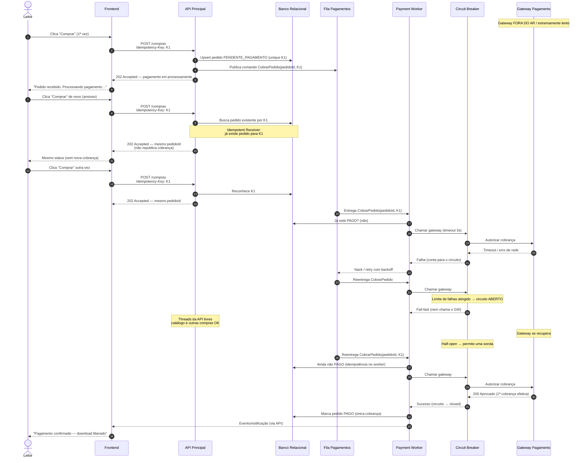

# Cotuba

O **Cotuba** é um gerador de ebooks via linha de comando (CLI) que converte arquivos em formato Markdown (`.md`) para os formatos **PDF** e **EPUB**. 

Ele é projetado para ser simples, rápido e executável em qualquer ambiente com o Java instalado, empacotando todas as suas dependências em um único arquivo (*fat jar*).

## 🛠 Tecnologias Utilizadas

* **Linguagem:** Java 25
* **Gerenciador de Dependências:** Maven
* **Empacotamento:** Maven Shade Plugin (Geração do *Fat JAR*)
* **Bibliotecas Principais:**
  * **Apache Commons CLI:** Para o parsing dos argumentos de linha de comando.
  * **CommonMark:** Para o parsing e renderização dos arquivos Markdown.
  * **iTextPDF:** Para a geração do arquivo final em PDF.
  * **Epublib:** Para a geração do arquivo final em EPUB.

---

## ⚙️ Como compilar o projeto

Para construir o projeto e gerar o executável com todas as dependências embutidas, certifique-se de ter o Java 25 e o Maven instalados. No diretório raiz do projeto, execute:

```bash
cd cotuba/
mvn clean package
```

Isso irá compilar os módulos Maven e gerar o executável (*fat JAR*) em `cotuba-cli/target/cotuba-cli-1.0-SNAPSHOT.jar`.

---

## 🚀 Como usar

O Cotuba é executado via terminal passando o `.jar` gerado. 

### Opções de Linha de Comando

| Opção | Argumento Longo | Descrição | Valor Padrão |
| :--- | :--- | :--- | :--- |
| `-d` | `--dir <arg>` | Diretório que contém os arquivos `.md`. | Diretório atual (`.`) |
| `-f` | `--format <arg>`| Formato de saída do ebook (`pdf` ou `epub`). | `pdf` |
| `-o` | `--output <arg>`| Nome do arquivo de saída do ebook gerado. | `book.{formato}` |
| `-v` | `--verbose` | Habilita o modo verboso para depuração/logs de erro. | Desativado |

### Livro de Exemplo

A pasta `apostila-design/` contém um livro de exemplo com 12 capítulos sobre **Software Design & System Design**, que cobre desde fundamentação teórica até implementação prática de padrões arquiteturais modernos.

Os arquivos Markdown são processados em ordem alfabética e convertidos em capítulos do ebook gerado.

### Exemplos de Uso

**1. Gerar um PDF (Comportamento Padrão)**
Se você apontar apenas o diretório, o Cotuba vai ler os arquivos Markdown e gerar um arquivo chamado `book.pdf` no diretório atual.

```bash
java -jar cotuba-cli/target/cotuba-cli-1.0-SNAPSHOT.jar -d ../apostila-design
```
*Equivalente a rodar explicitamente com a flag de formato:*
```bash
java -jar cotuba-cli/target/cotuba-cli-1.0-SNAPSHOT.jar -d ../apostila-design -f pdf
```

**2. Gerar um EPUB**
Para alterar o formato de saída para EPUB, utilize a flag `-f epub`. Isso irá gerar um arquivo `book.epub`.

```bash
java -jar cotuba-cli/target/cotuba-cli-1.0-SNAPSHOT.jar -d ../apostila-design -f epub
```

**3. Customizar o nome do arquivo de saída**
Você pode usar a flag `-o` para definir o nome exato e o caminho do arquivo gerado.

```bash
java -jar cotuba-cli/target/cotuba-cli-1.0-SNAPSHOT.jar -d ../apostila-design -o apostila-design.pdf
```

---

## Cotubify — Arquitetura e resiliência

O motor Cotuba alimenta a plataforma **Cotubify**. Decisões de arquitetura da plataforma:

- [ADR 001 — Geração assíncrona de e-books via fila de mensagens](adr/adr-001-geracao-assincrona.md)
- [ADR 002 — Cache em memória para o catálogo “Top 100”](adr/adr-002-cache-catalogo.md)
- [ADR 003 — Resiliência de pagamentos (Circuit Breaker, fila e Idempotent Receiver)](adr/adr-003-resiliencia-pagamentos.md)

Documentação C4 completa: [arquitetura/README.md](arquitetura/README.md).

## Fluxo de Resiliência de Pagamento

Unhappy path: o leitor clica várias vezes em “Comprar” enquanto o Gateway de Pagamento está fora do ar. A API permanece responsiva (pedido assíncrono + idempotência); o worker isola a falha com timeout e Circuit Breaker; apenas **uma** cobrança efetiva ocorre quando o parceiro volta.


