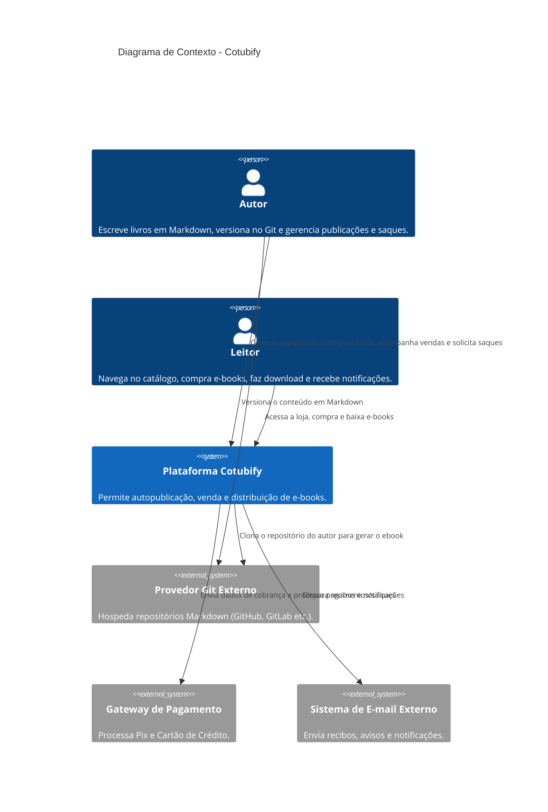
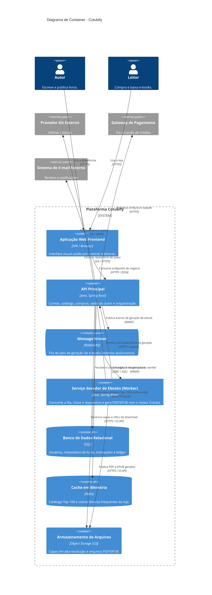

# Arquitetura Cotubify

O Cotubify é uma plataforma ponta a ponta de autopublicação de e-books.
Autores conectam repositórios Git com conteúdo em Markdown, configuram livros e acompanham vendas;
leitores navegam no catálogo, compram e baixam os arquivos gerados (PDF e EPUB).

## Decisões de Arquitetura (ADRs)

As decisões de escalabilidade da plataforma estão registradas como Architecture Decision Records:

- [ADR 001 — Geração assíncrona de e-books via fila de mensagens](../adr/adr-001-geracao-assincrona.md)
- [ADR 002 — Cache em memória para o catálogo “Top 100”](../adr/adr-002-cache-catalogo.md)

## Diagrama de Contexto

Visão de fronteiras do sistema (C4 Nível 1): pessoas, a plataforma e os sistemas externos com os quais ela se integra.

## Diagrama de Container

Zoom para dentro da plataforma (C4 Nível 2): os containers implantáveis, suas responsabilidades e protocolos de comunicação.

A arquitetura de containers reflete as decisões de escalabilidade dos [ADRs](#decisões-de-arquitetura-adrs):

- a geração de e-books é **assíncrona** via **Message Broker** (o Gerador atua como *worker*);
- o catálogo da loja (Top 100) é servido preferencialmente por um **Cache em memória**.

